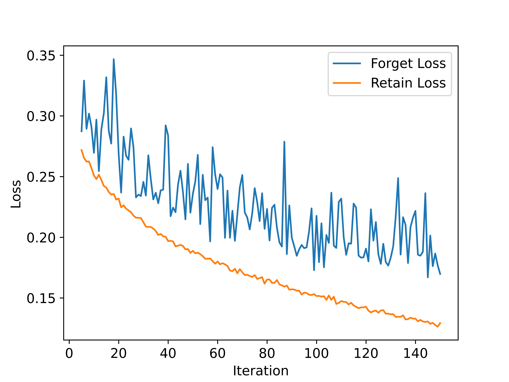
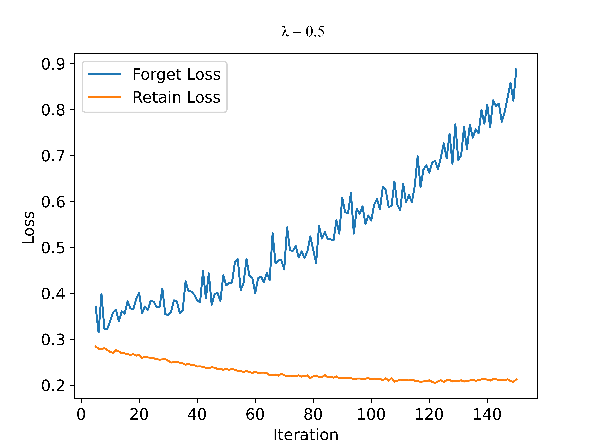
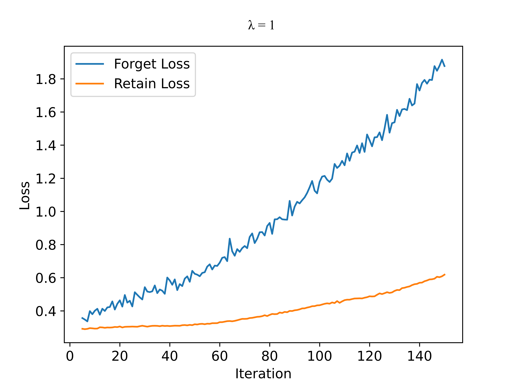
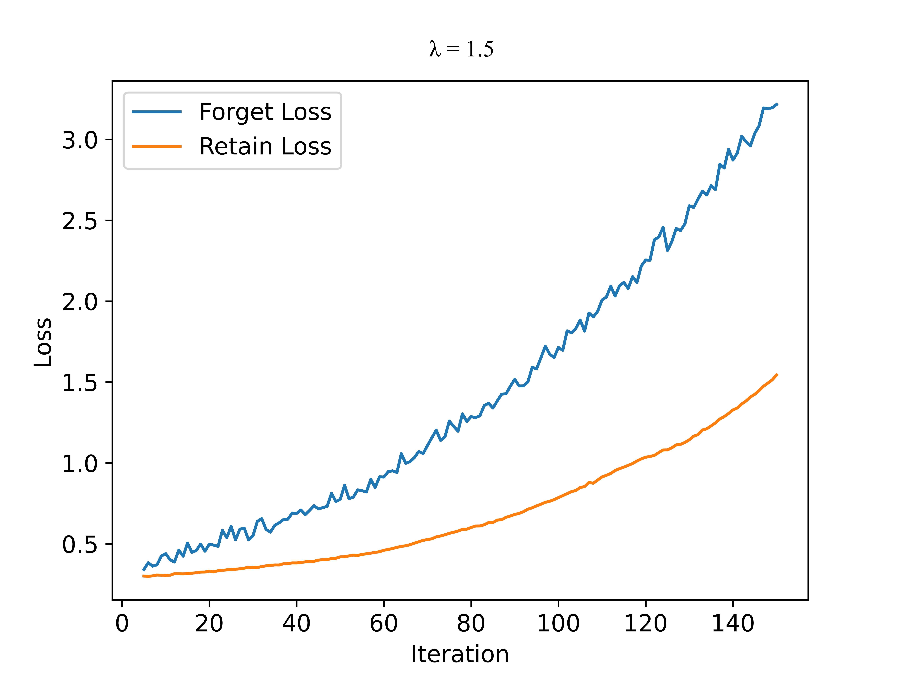
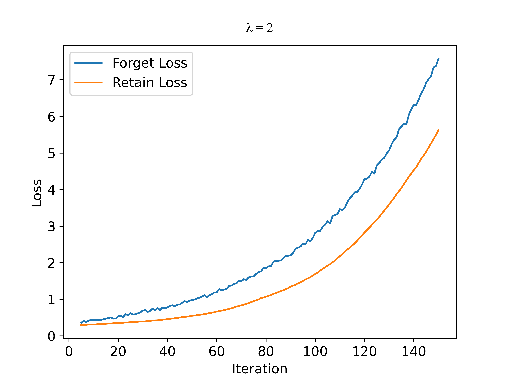

# Additional Experiments

## Catalogue
- [For Reviewer BzXw](#BzXw)
   - [Methods And Evaluation Criteria](#BzXw_M)
- [For Reviewer WHHW](#WHHW)
  - [Methods And Evaluation Criteria: M3 and Essential References Not Discussed](#WHHW_M)
- [For Reviewer 9xQG](#9xQG)
  - [Claims And Evidence](#9xQG_C)
    - [C3](#9xQG_C3)
    - [C4](#9xQG_C4)
  - [Essential References Not Discussed](#9xQG_E)
  - [Other Comments Or Suggestions](#9xQG_O)

## For Reviewer BzXw
### For Methods And Evaluation Criteria
The forget classes are chosen randomly for fair comparison.
#### Random Subset Unlearning Experiment results on CUB dataset with ResNet18 model

| Metric | Original | Retrain | FT w/o $\mathcal{D}_f$ | Random | BadT | SalUn | SSD | VGE-BF|
| :---: | :---: | :---: | :---: | :---: | :---: | :---: | :---: | :---: |
| $\mathcal{D}_r$ | 100.00 $\scriptsize{\pm}$ 0.00 | **100.00 $\scriptsize{\pm}$ 0.01** | 97.68 $\scriptsize{\pm}$ 1.20 | 86.47 $\scriptsize{\pm}$ 5.72 | **100.00 $\scriptsize{\pm}$ 0.00**  | 99.07 $\scriptsize{\pm}$ 0.09 | **100.00 $\scriptsize{\pm}$ 0.00** | 99.99 $\scriptsize{\pm}$ 0.02 |
| $\mathcal{D}_f$ | 100.00 $\scriptsize{\pm}$ 0.00 | **64.77 $\scriptsize{\pm}$ 2.14** | 81.10 $\scriptsize{\pm}$ 5.27 | 51.42 $\scriptsize{\pm}$ 6.97 | 100.00 $\scriptsize{\pm}$ 0.00 | 92.02 $\scriptsize{\pm}$ 0.30 | 100.00 $\scriptsize{\pm}$ 0.00 | **67.31 $\scriptsize{\pm}$ 2.55** |
| $\mathcal{D}_{test}$ | 70.74 $\scriptsize{\pm}$ 0.45 | **69.28 $\scriptsize{\pm}$ 1.55** | 53.31 $\scriptsize{\pm}$ 2.60 | 45.35 $\scriptsize{\pm}$ 5.31 | **69.00 $\scriptsize{\pm}$ 1.12**  | 49.24 $\scriptsize{\pm}$ 0.22 | 72.45 $\scriptsize{\pm}$ 0.37 | 67.07 $\scriptsize{\pm}$ 1.49 |
| MIA | 79.58 $\scriptsize{\pm}$ 0.50 | **51.22 $\scriptsize{\pm}$ 1.58** | 65.18 $\scriptsize{\pm}$ 1.58 | **52.33 $\scriptsize{\pm}$ 1.40** | 78.50 $\scriptsize{\pm}$ 0.62 | 73.20 $\scriptsize{\pm}$ 0.97 | 81.40 $\scriptsize{\pm}$ 1.35 | 48.70 $\scriptsize{\pm}$ 2.56 |

#### Continual Unlearning Experiment results on CUB dataset with ResNet18 model

| Metric | Original | Retrain | FT w/o $\mathcal{D}_f$ | Random | BadT | SalUn | SSD | VGE-BF|
| :---: | :---: | :---: | :---: | :---: | :---: | :---: | :---: | :---: |
| $\mathcal{D}_r$ | 100.00 $\scriptsize{\pm}$ 0.00 | **100.00 $\scriptsize{\pm}$ 0.00** | 99.11 $\scriptsize{\pm}$ 0.39 | 97.56 $\scriptsize{\pm}$ 2.48 | **100.00 $\scriptsize{\pm}$ 0.00** | 98.23 $\scriptsize{\pm}$ 0.04 | **100.00 $\scriptsize{\pm}$ 0.00** | 99.96 $\scriptsize{\pm}$ 0.07 |
| $\mathcal{D}_f$ | 100.00 $\scriptsize{\pm}$ 0.00 | **64.05 $\scriptsize{\pm}$ 0.63** | **64.05 $\scriptsize{\pm}$ 2.88** | 63.83 $\scriptsize{\pm}$ 2.95 | 100.00 $\scriptsize{\pm}$ 0.00 | 95.77 $\scriptsize{\pm}$ 0.19 | 100.00 $\scriptsize{\pm}$ 0.00 | 67.89 $\scriptsize{\pm}$ 2.43 |
| $\mathcal{D}_{test}$ | 70.74 $\scriptsize{\pm}$ 0.45 | **68.86 $\scriptsize{\pm}$ 0.69** | 52.46 $\scriptsize{\pm}$ 1.33 | 58.50 $\scriptsize{\pm}$ 2.71 | 69.44 $\scriptsize{\pm}$ 1.04 | 52.55 $\scriptsize{\pm}$ 0.85 | 72.50 $\scriptsize{\pm}$ 0.46 | **67.25 $\scriptsize{\pm}$ 1.55** |
| MIA | 79.58 $\scriptsize{\pm}$ 0.50 | **51.39 $\scriptsize{\pm}$ 2.22** | 55.42 $\scriptsize{\pm}$ 1.04 | 53.89 $\scriptsize{\pm}$ 0.97 | 79.06 $\scriptsize{\pm}$ 0.13 | 74.42 $\scriptsize{\pm}$ 1.18 | 80.97 $\scriptsize{\pm}$ 0.55 | **50.39 $\scriptsize{\pm}$ 0.21** |

#### Class Unlearning Experiment results on CUB dataset with ResNet18 model

##### Unlearning on class Lazuli_Bunting

| Metric | Original | Retrain | FT w/o $\mathcal{D}_f$ | Random | BadT | SalUn | SSD | VGE-BF|
| :---: | :---: | :---: | :---: | :---: | :---: | :---: | :---: | :---: |
| $\mathcal{D}_r$ | 100.00 $\scriptsize{\pm}$ 0.00 | **100.00 $\scriptsize{\pm}$ 0.00** | 95.45 $\scriptsize{\pm}$ 0.93 | 97.79 $\scriptsize{\pm}$ 0.43 | **100.00 $\scriptsize{\pm}$ 0.00** | **100.00 $\scriptsize{\pm}$ 9.00** | 55.96 $\scriptsize{\pm}$ 0.01 | **100.00 $\scriptsize{\pm}$ 0.01** |
| $\mathcal{D}_f$ | 100.00 $\scriptsize{\pm}$ 0.00 | **0.00 $\scriptsize{\pm}$ 0.00** | **0.00 $\scriptsize{\pm}$ 0.00** | **0.00 $\scriptsize{\pm}$ 0.00** | **0.00 $\scriptsize{\pm}$ 0.00** | 3.33 $\scriptsize{\pm}$ 0.00 | **0.00 $\scriptsize{\pm}$ 0.00** | **0.00 $\scriptsize{\pm}$ 0.00** |
| $\mathcal{D}_{test}$ | 70.80 $\scriptsize{\pm}$ 0.65 | **71.04 $\scriptsize{\pm}$ 0.72** | 49.91 $\scriptsize{\pm}$ 0.95 | 54.58 $\scriptsize{\pm}$ 2.25 | 69.05 $\scriptsize{\pm}$ 0.54 | 70.22 $\scriptsize{\pm}$ 0.60 | 25.13 $\scriptsize{\pm}$ 0.66 | **69.43 $\scriptsize{\pm}$ 1.33** |
| Relearn Time |   | **43.60 $\scriptsize{\pm}$ 15.92** | 49.2 $\scriptsize{\pm}$ 22.62 | **42.20 $\scriptsize{\pm}$ 4.75** | 16.8 $\scriptsize{\pm}$ 3.42 | 25.80 $\scriptsize{\pm}$ 11.63 | 85.60 $\scriptsize{\pm}$ 16.83 | 48.4 $\scriptsize{\pm}$ 23.39 |

##### Unlearning on class Fish_Crow

| Metric | Original | Retrain | FT w/o $\mathcal{D}_f$ | Random | BadT | SalUn | SSD | VGE-BF|
| :---: | :---: | :---: | :---: | :---: | :---: | :---: | :---: | :---: |
| $\mathcal{D}_r$ | 100.00 $\scriptsize{\pm}$ 0.00 | **100.00 $\scriptsize{\pm}$ 0.00** | 94.88 $\scriptsize{\pm}$ 2.60 | 95.87 $\scriptsize{\pm}$ 2.04 | **100.00 $\scriptsize{\pm}$ 0.00** | **100.00 $\scriptsize{\pm}$ 0.00** | 13.78 $\scriptsize{\pm}$ 0.00 | **100.00 $\scriptsize{\pm}$ 0.01** |
| $\mathcal{D}_f$ | 100.00 $\scriptsize{\pm}$ 0.00 | **0.00 $\scriptsize{\pm}$ 0.00** | **0.00 $\scriptsize{\pm}$ 0.00** | **0.00 $\scriptsize{\pm}$ 0.00** | **0.00 $\scriptsize{\pm}$ 0.00** | **0.00 $\scriptsize{\pm}$ 0.00** | **0.00 $\scriptsize{\pm}$ 0.00** | **0.00 $\scriptsize{\pm}$ 0.00** |
| $\mathcal{D}_{test}$ | 70.39 $\scriptsize{\pm}$ 0.31 | **71.29 $\scriptsize{\pm}$ 1.05** | 50.42 $\scriptsize{\pm}$ 3.93 | 52.55 $\scriptsize{\pm}$ 3.48 | 68.22 $\scriptsize{\pm}$ 0.66 | **72.00 $\scriptsize{\pm}$ 0.24** | 8.72 $\scriptsize{\pm}$ 0.30 | 68.83 $\scriptsize{\pm}$ 0.80 |
| Relearn Time |   | **146.2 $\scriptsize{\pm}$ 19.33** | 62.6 $\scriptsize{\pm}$ 20.04 | 86.4 $\scriptsize{\pm}$ 31.21 | 28.4 $\scriptsize{\pm}$ 6.69 | 51.2 $\scriptsize{\pm}$ 20.57 | 83.8 $\scriptsize{\pm}$ 25.06 | **96 $\scriptsize{\pm}$ 39.55** |

## For Reviewer WHHW

### For Methods And Evaluation Criteria: M3 and Essential References Not Discussed
The additional experiments here include additional metrics, such as "relearn time," on class unlearning and subclass unlearning, and an additional baseline method, SFR-on. The forget classes are chosen based on the setting in the work of SSD.

#### Random Subset Unlearning Experiment results on CIFAR-100 dataset with ResNet18 model.
| Metric | Original | Retrain | SalUn | SFR-on | VGE-BF |
| :---: | :---: | :---: | :---: | :---: | :---: |
| $\mathcal{D}_r$ |     |     |     |     |     |
| $\mathcal{D}_f$ |     |     |     |     |     |
| $\mathcal{D}_{test}$ |     |     |     |     |     |
| MIA |     |     |     |     |     |

#### Continual Unlearning Experiment results on CIFAR-100 dataset with ResNet18 model.
| Metric | Original | Retrain | SalUn | SFR-on | VGE-BF |
| :---: | :---: | :---: | :---: | :---: | :---: |
| $\mathcal{D}_r$ |     |     |     |     |     |
| $\mathcal{D}_f$ |     |     |     |     |     |
| $\mathcal{D}_{test}$ |     |     |     |     |     |
| MIA |     |     |     |     |     |

#### Class Unlearning Experiment results on CIFAR-100 dataset with ResNet18 model.
##### Unlearning on class Rocket.
<!--- | Metric | Original | Retrain | FT w/o $\mathcal{D}_f$ | Random | BadT | SalUn | SFR-on | SSD | VGE-BF|
| :---: | :---: | :---: | :---: | :---: | :---: | :---: | :---: | :---: | :---: |
| $\mathcal{D}_r$ |     |     |     |     |     |     |     |     |     |
| $\mathcal{D}_f$ |     |     |     |     |     |     |     |     |     |
| $\mathcal{D}_{test}$ |     |     |     |     |     |     |     |     |     |
| Relearn Time |     |     |     |     |     |     |     |     |     |] -->

| Metric | Original | Retrain | SalUn | SFR-on | VGE-BF |
| :---: | :---: | :---: | :---: | :---: | :---: |
| $\mathcal{D}_r$ |     |     |     |     |     |
| $\mathcal{D}_f$ |     |     |     |     |     |
| $\mathcal{D}_{test}$ |     |     |     |     |     |
| Relearn Time |     |     |     |     |     |

##### Unlearning on class Mushroom.
<!--- | Metric | Original | Retrain | FT w/o $\mathcal{D}_f$ | Random | BadT | SalUn | SFR-on | SSD | VGE-BF|
| :---: | :---: | :---: | :---: | :---: | :---: | :---: | :---: | :---: | :---: |
| $\mathcal{D}_r$ |     |     |     |     |     |     |     |     |     |
| $\mathcal{D}_f$ |     |     |     |     |     |     |     |     |     |
| $\mathcal{D}_{test}$ |     |     |     |     |     |     |     |     |     |
| Relearn Time |     |     |     |     |     |     |     |     |     |] -->

| Metric | Original | Retrain | SalUn | SFR-on | VGE-BF |
| :---: | :---: | :---: | :---: | :---: | :---: |
| $\mathcal{D}_r$ |     |     |     |     |     |
| $\mathcal{D}_f$ |     |     |     |     |     |
| $\mathcal{D}_{test}$ |     |     |     |     |     |
| Relearn Time |     |     |     |     |     |

#### Subclass Unlearning Experiment results on CIFAR-20 dataset with ResNet18 model.
##### Unlearning on class Rocket.
<!--- | Metric | Original | Retrain | FT w/o $\mathcal{D}_f$ | Random | BadT | SalUn | SFR-on | SSD | VGE-BF|
| :---: | :---: | :---: | :---: | :---: | :---: | :---: | :---: | :---: | :---: |
| $\mathcal{D}_r$ |     |     |     |     |     |     |     |     |     |
| $\mathcal{D}_f$ |     |     |     |     |     |     |     |     |     |
| $\mathcal{D}_{test}$ |     |     |     |     |     |     |     |     |     |
| Relearn Time |     |     |     |     |     |     |     |     |     |] -->

| Metric | Original | Retrain | SalUn | SFR-on | VGE-BF |
| :---: | :---: | :---: | :---: | :---: | :---: |
| $\mathcal{D}_r$ |     |     |     |     |     |
| $\mathcal{D}_f$ |     |     |     |     |     |
| $\mathcal{D}_{test}$ |     |     |     |     |     |
| Relearn Time |     |     |     |     |     |

##### Unlearning on class Sea.
<!--- | Metric | Original | Retrain | FT w/o $\mathcal{D}_f$ | Random | BadT | SalUn | SFR-on | SSD | VGE-BF|
| :---: | :---: | :---: | :---: | :---: | :---: | :---: | :---: | :---: | :---: |
| $\mathcal{D}_r$ |     |     |     |     |     |     |     |     |     |
| $\mathcal{D}_f$ |     |     |     |     |     |     |     |     |     |
| $\mathcal{D}_{test}$ |     |     |     |     |     |     |     |     |     |
| Relearn Time |     |     |     |     |     |     |     |     |     |] -->

| Metric | Original | Retrain | SalUn | SFR-on | VGE-BF |
| :---: | :---: | :---: | :---: | :---: | :---: |
| $\mathcal{D}_r$ |     |     |     |     |     |
| $\mathcal{D}_f$ |     |     |     |     |     |
| $\mathcal{D}_{test}$ |     |     |     |     |     |
| Relearn Time |     |     |     |     |     |

## For Reviewer 9xQG

### For Answers to Questions: A1
Please refer to [C3](#9xQG_C3) for details.

### For Claims And Evidence

#### C3

We used different value for the coefficient($\lambda$) to the loss on the forget set in NegGrad+ to update the model during gradient ascent. 

$\lambda=0$

$\lambda=0.5$

$\lambda=1$

$\lambda=1.5$

$\lambda=2$

#### C4
We set epoch the epoch for the retrained model to 10. Hyperparameters for other methods follow their experimental settings in their work. 

| $t=5$ | $\mathcal{D}_r$ | $\mathcal{D}_f$ | $\mathcal{D}_{test}$ | MIA |
| :---: | :---: | :---: | :---: | :---: |
| Original | 77.31 | 78.06 | 52.32 | 62.80 |
| Retrain | **90.81** | **50.26** | **51.28** | **49.91** |
| FT w/o $\mathcal{D}_f$ | 81.87 | 66.04 | **50.54** | **57.94** |
| BadT | 67.37 | **64.50** | 49.64 | 58.39 |
| SalUn | **87.76** | 80.50 | 54.99 | 62.94 |
| $t=10$ | $\mathcal{D}_r$ | $\mathcal{D}_f$ | $\mathcal{D}_{test}$ | MIA |
| Original | 91.59 | 92.00 | 52.78 | 70.03 |
| Retrain | **90.11** | **49.60** | **50.64** | **50.62** |
| FT w/o $\mathcal{D}_f$ | **93.20** | 83.04 | **51.74** | 66.02 |
| BadT | 83.45 | **78.70** | 49.74 | **64.70** |
| SalUn | 96.25 | 89.71 | 52.77 | 68.38 |
| $t=15$ | $\mathcal{D}_r$ | $\mathcal{D}_f$ | $\mathcal{D}_{test}$ | MIA |
| Original | 95.54 | 95.48 | 52.22 | 71.55 |
| Retrain | **90.22** | **50.16** | **50.81** | **50.32** |
| FT w/o $\mathcal{D}_f$ | 96.02 | 89.50 | **50.28** | 69.89 |
| BadT | **92.12** | **87.18** | 49.68 | **68.94** |
| SalUn | 98.39 | 92.72 | 51.91 | 70.48 |

### For Essential References Not Discussed

#### Random Subset Unlearning Experiment results on CIFAR-100 dataset with ResNet18 model.
| Metric | Original | Retrain | SCRUB | Rewind-to-delete | VGE-BF|
| :---: | :---: | :---: | :---: | :---: | :---: |
| $\mathcal{D}_r$ |     |     |     |     |     |
| $\mathcal{D}_f$ |     |     |     |     |     |
| $\mathcal{D}_{test}$ |     |     |     |     |     |
| MIA |     |     |     |     |     |

#### Continual Unlearning Experiment results on CIFAR-100 dataset with ResNet18 model.
| Metric | Original | Retrain | SCRUB | Rewind-to-delete | VGE-BF|
| :---: | :---: | :---: | :---: | :---: | :---: |
| $\mathcal{D}_r$ |     |     |     |     |     |
| $\mathcal{D}_f$ |     |     |     |     |     |
| $\mathcal{D}_{test}$ |     |     |     |     |     |
| MIA |     |     |     |     |     |

#### Class Unlearning Experiment results on CIFAR-100 dataset with ResNet18 model.
##### Unlearning on class Rocket.
| Metric | Original | Retrain | SCRUB | Rewind-to-delete | VGE-BF|
| :---: | :---: | :---: | :---: | :---: | :---: |
| $\mathcal{D}_r$ |     |     |     |     |     |
| $\mathcal{D}_f$ |     |     |     |     |     |
| $\mathcal{D}_{test}$ |     |     |     |     |     |

##### Unlearning on class Mushroom.
| Metric | Original | Retrain |SCRUB | Rewind-to-delete | VGE-BF|
| :---: | :---: | :---: | :---: | :---: | :---: |
| $\mathcal{D}_r$ |     |     |     |     |     |
| $\mathcal{D}_f$ |     |     |     |     |     |
| $\mathcal{D}_{test}$ |     |     |     |     |     |

#### Subclass Unlearning Experiment results on CIFAR-20 dataset with ResNet18 model.
##### Unlearning on class Rocket.
| Metric | Original | Retrain | SCRUB | Rewind-to-delete | VGE-BF|
| :---: | :---: | :---: | :---: | :---: | :---: |
| $\mathcal{D}_r$ |     |     |     |     |     |
| $\mathcal{D}_f$ |     |     |     |     |     |
| $\mathcal{D}_{test}$ |     |     |     |     |     |

##### Unlearning on class Sea.
| Metric | Original | Retrain | SCRUB | Rewind-to-delete | VGE-BF|
| :---: | :---: | :---: | :---: | :---: | :---: |
| $\mathcal{D}_r$ |     |     |     |     |     |
| $\mathcal{D}_f$ |     |     |     |     |     |
| $\mathcal{D}_{test}$ |     |     |     |     |     |

### For Other Comments Or Suggestions
The forget class (Mushroom) is one of the classes used in the main paper. $t=5$ is the VGE seleted checkpoint.
#### Ablation experiments on the selection of the early stopping epoch (under class unlearning).
| Metric | Original | Retrain | $t=1$ | $t=3$ | $t=5$ | $t=7$ | $t=9$ |
| :---: | :---: | :---: | :---: | :---: | :---: | :---: | :---: |
| $\mathcal{D}_r$ | 90.54 $\scriptsize{\pm}$ 0.00 | **90.56 $\scriptsize{\pm}$ 0.83** | 80.52 $\scriptsize{\pm}$ 1.32 | 86.99 $\scriptsize{\pm}$ 0.73 | **91.45 $\scriptsize{\pm}$ 0.98** | 93.56 $\scriptsize{\pm}$ 0.62 | 94.71 $\scriptsize{\pm}$ 0.51 |
| $\mathcal{D}_f$ | 93.80 $\scriptsize{\pm}$ 0.00 | **0.00 $\scriptsize{\pm}$ 0.00** | **0.00 $\scriptsize{\pm}$ 0.00** | **0.00 $\scriptsize{\pm}$ 0.00** | **0.00 $\scriptsize{\pm}$ 0.00** | **0.00 $\scriptsize{\pm}$ 0.00** | **0.00 $\scriptsize{\pm}$ 0.00** |
| $\mathcal{D}_{test}$ | 51.94 $\scriptsize{\pm}$ 0.48 | **51.99 $\scriptsize{\pm}$ 0.69** | **51.92 $\scriptsize{\pm}$ 1.00** | 52.45 $\scriptsize{\pm}$ 0.40 | 52.40 $\scriptsize{\pm}$ 0.80 | 52.16 $\scriptsize{\pm}$ 0.51 | 52.55 $\scriptsize{\pm}$ 0.55 |

